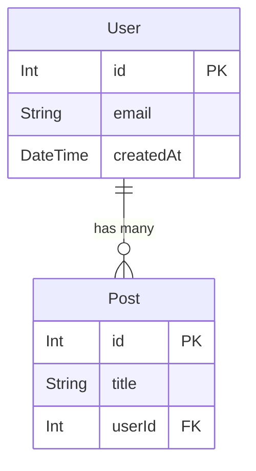

# Multi-Database ERD Support

DevReview AI now supports automatic Entity Relationship Diagram (ERD) generation from **7 different database schema formats**. The system automatically detects the schema format and generates standardized Mermaid diagrams.

## Supported Database Formats

### 1. Prisma ORM

**Trigger Files**: `**/*.prisma`, `prisma/schema.prisma`

**Features**:
- Extracts `model` blocks
- Detects field types (String, Int, Float, Boolean, DateTime, Json, BigInt, Decimal, Bytes)
- Identifies primary keys via `@id` decorator
- Parses `@relation` decorators for relationships
- Detects ONE_TO_ONE, ONE_TO_MANY, and MANY_TO_MANY relationships

**Example**:
```prisma
model User {
  id        Int      @id @default(autoincrement())
  email     String   @unique
  posts     Post[]
}

model Post {
  id       Int    @id @default(autoincrement())
  title    String
  userId   Int
  user     User   @relation(fields: [userId], references: [id])
}
```

---

### 2. SQL DDL

**Trigger Files**: `**/schema.sql`, `**/migrations/**/*.sql`, `**/*.ddl.sql`

**Features**:
- Parses `CREATE TABLE` statements
- Extracts column names and data types
- Identifies PRIMARY KEY constraints
- Detects FOREIGN KEY constraints with REFERENCES clauses
- Supports both inline and separate constraint definitions

**Example**:
```sql
CREATE TABLE users (
  id INT PRIMARY KEY AUTO_INCREMENT,
  email VARCHAR(255) NOT NULL UNIQUE,
  created_at TIMESTAMP DEFAULT CURRENT_TIMESTAMP
);

CREATE TABLE posts (
  id INT PRIMARY KEY AUTO_INCREMENT,
  title VARCHAR(255) NOT NULL,
  user_id INT,
  FOREIGN KEY (user_id) REFERENCES users(id)
);
```

---

### 3. TypeORM

**Trigger Files**: `**/*.entity.ts`, `**/*.entity.js`, `**/entities/**/*.ts`

**Features**:
- Extracts `@Entity()` decorated classes
- Parses column decorators: `@Column`, `@PrimaryGeneratedColumn`, `@PrimaryColumn`, `@CreateDateColumn`, `@UpdateDateColumn`
- Detects relationship decorators: `@OneToOne`, `@OneToMany`, `@ManyToOne`, `@ManyToMany`
- Automatically infers foreign keys from column names ending in 'Id'

**Example**:
```typescript
import { Entity, PrimaryGeneratedColumn, Column, OneToMany } from 'typeorm';

@Entity()
export class User {
  @PrimaryGeneratedColumn()
  id: number;

  @Column()
  email: string;

  @OneToMany(() => Post, post => post.user)
  posts: Post[];
}

@Entity()
export class Post {
  @PrimaryGeneratedColumn()
  id: number;

  @Column()
  title: string;

  @Column()
  userId: number;

  @ManyToOne(() => User, user => user.posts)
  user: User;
}
```

---

### 4. Sequelize

**Trigger Files**: `**/models/**/*.js`, `**/models/**/*.ts`, `**/*.model.js`, `**/*.model.ts`

**Features**:
- Parses `sequelize.define()` and `Model.init()` calls
- Extracts DataTypes (STRING, INTEGER, BOOLEAN, DATE, etc.)
- Identifies primaryKey and references options
- Detects association methods: `hasMany`, `belongsTo`, `hasOne`, `belongsToMany`

**Example**:
```javascript
const User = sequelize.define('User', {
  id: {
    type: DataTypes.INTEGER,
    primaryKey: true,
    autoIncrement: true
  },
  email: {
    type: DataTypes.STRING,
    unique: true
  }
});

const Post = sequelize.define('Post', {
  id: {
    type: DataTypes.INTEGER,
    primaryKey: true
  },
  title: DataTypes.STRING,
  userId: {
    type: DataTypes.INTEGER,
    references: {
      model: 'User',
      key: 'id'
    }
  }
});

User.hasMany(Post);
Post.belongsTo(User);
```

---

### 5. Drizzle ORM

**Trigger Files**: `**/drizzle/schema.ts`, `**/drizzle/schema/**/*.ts`, `**/schema/drizzle.ts`

**Features**:
- Parses `pgTable()`, `mysqlTable()`, `sqliteTable()` definitions
- Extracts column types (integer, text, varchar, boolean, timestamp, etc.)
- Detects `.primaryKey()`, `.notNull()`, `.unique()` modifiers
- Parses `.references()` for foreign keys
- Extracts `relations()` definitions for relationship mappings

**Example**:
```typescript
import { pgTable, serial, text, integer } from 'drizzle-orm/pg-core';
import { relations } from 'drizzle-orm';

export const users = pgTable('users', {
  id: serial('id').primaryKey(),
  email: text('email').notNull().unique(),
});

export const posts = pgTable('posts', {
  id: serial('id').primaryKey(),
  title: text('title').notNull(),
  userId: integer('user_id').references(() => users.id),
});

export const usersRelations = relations(users, ({ many }) => ({
  posts: many(posts),
}));

export const postsRelations = relations(posts, ({ one }) => ({
  user: one(users, {
    fields: [posts.userId],
    references: [users.id],
  }),
}));
```

---

### 6. Mongoose (MongoDB)

**Trigger Files**: `**/schemas/**/*.ts`, `**/schemas/**/*.js`, `**/*.schema.ts`, `**/*.schema.js`

**Features**:
- Parses `new Schema()` definitions
- Extracts field types (String, Number, Boolean, Date, ObjectId, Array, etc.)
- Detects `ref` properties for relationships
- Maps schema variable names to model names via `mongoose.model()`
- Identifies MongoDB-specific types like ObjectId

**Example**:
```typescript
import mongoose from 'mongoose';

const UserSchema = new mongoose.Schema({
  email: { type: String, required: true, unique: true },
  name: String,
  createdAt: { type: Date, default: Date.now }
});

const PostSchema = new mongoose.Schema({
  title: { type: String, required: true },
  content: String,
  userId: { 
    type: mongoose.Schema.Types.ObjectId, 
    ref: 'User',
    required: true 
  }
});

export const User = mongoose.model('User', UserSchema);
export const Post = mongoose.model('Post', PostSchema);
```

---

### 7. Knex.js

**Trigger Files**: `**/migrations/**/*.js`, `**/migrations/**/*.ts`, `knexfile.js`, `knexfile.ts`

**Features**:
- Parses `createTable()` migration calls
- Extracts column types (increments, integer, string, text, boolean, date, datetime, timestamp, json, uuid, etc.)
- Detects `.primary()` modifiers
- Parses `.references()` and `.inTable()` for foreign key relationships
- Supports chained column modifiers

**Example**:
```javascript
exports.up = function(knex) {
  return knex.schema
    .createTable('users', (table) => {
      table.increments('id').primary();
      table.string('email', 255).notNullable().unique();
      table.timestamps(true, true);
    })
    .createTable('posts', (table) => {
      table.increments('id').primary();
      table.string('title', 255).notNullable();
      table.integer('user_id')
        .unsigned()
        .references('id')
        .inTable('users')
        .onDelete('CASCADE');
      table.timestamps(true, true);
    });
};
```

---

## How It Works

### Automatic Format Detection

The system uses a priority-based detection algorithm:

1. **Prisma**: Checks for `model` keyword and `.prisma` file extensions
2. **SQL DDL**: Looks for `CREATE TABLE` statements
3. **TypeORM**: Detects `@Entity` or `@Column` decorators
4. **Drizzle**: Finds `pgTable`, `mysqlTable`, or `sqliteTable` calls
5. **Sequelize**: Searches for `sequelize.define` or `Model.init`
6. **Mongoose**: Looks for `new Schema()` or `mongoose.model`
7. **Knex**: Detects `createTable()` calls or `knex.schema`

### Output Format

All parsers generate a standardized Mermaid ERD format:



### Relationship Types

| Symbol     | Relationship   | Description                                 |
| ---------- | -------------- | ------------------------------------------- |
| `||--\|\|` | ONE_TO_ONE     | One user has one profile                    |
| `||--o{`   | ONE_TO_MANY    | One user has many posts                     |
| `}o--o{`   | MANY_TO_MANY   | Many posts have many tags                   |
| `-->`      | ASSOCIATES     | Generic association (fallback)              |
| `--\|>`    | INHERITS       | Class inheritance (for CLASS diagrams only) |

---

## Trigger Patterns

ERD diagrams are automatically generated when changes are detected in:

```typescript
{
  type: "ERD",
  patterns: [
    // Prisma
    "prisma/schema.prisma",
    "**/*.prisma",
    // SQL DDL
    "**/schema.sql",
    "**/migrations/**/*.sql",
    "**/*.ddl.sql",
    // TypeORM
    "**/*.entity.ts",
    "**/*.entity.js",
    "**/entities/**/*.ts",
    // Sequelize
    "**/models/**/*.js",
    "**/models/**/*.ts",
    "**/*.model.js",
    "**/*.model.ts",
    // Drizzle ORM
    "**/drizzle/schema.ts",
    "**/drizzle/schema/**/*.ts",
    "**/schema/drizzle.ts",
    // Mongoose
    "**/schemas/**/*.ts",
    "**/schemas/**/*.js",
    "**/*.schema.ts",
    "**/*.schema.js",
    // Knex
    "**/migrations/**/*.js",
    "**/migrations/**/*.ts",
    "knexfile.js",
    "knexfile.ts",
  ],
}
```

---

## API Usage

### Via tRPC

```typescript
// Request diagram generation
const diagram = await trpc.diagram.requestDiagram.mutate({
  repositoryId: 'repo-id',
  type: 'ERD'
});

// List diagrams for a repository
const diagrams = await trpc.diagram.listForRepository.query({
  repositoryId: 'repo-id'
});

// Get specific diagram
const erd = await trpc.diagram.getById.query({
  id: 'diagram-id'
});
```

### Via Inngest (Background Job)

```typescript
await inngest.send({
  name: 'diagram/generate-diagram',
  data: {
    repositoryId: 'repo-id',
    type: 'ERD',
    changedFiles: ['prisma/schema.prisma']
  }
});
```

---

## Database Schema

```prisma
model Diagram {
  id           String   @id @default(cuid())
  repositoryId String
  type         DiagramType  // ERD | CLASS | USE_CASE
  definition   String   // Mermaid text
  nodes        Json     // Parsed node data
  edges        Json     // Parsed edge data
  status       DiagramStatus // PENDING | COMPLETED | FAILED
  errorMessage String?
  createdAt    DateTime @default(now())
  updatedAt    DateTime @updatedAt
  
  repository   Repository @relation(fields: [repositoryId], references: [id], onDelete: Cascade)
  
  @@unique([repositoryId, type])
  @@index([repositoryId])
}
```

---

## Future Enhancements

### Planned Support

- **ActiveRecord (Ruby on Rails)**: Parse Rails migration files
- **Entity Framework (C#)**: Extract from `.edmx` or DbContext classes
- **Hibernate (Java)**: Parse JPA annotations
- **SQLAlchemy (Python)**: Extract from ORM models
- **Doctrine (PHP)**: Parse entity annotations

### Additional Features

- **Diagram Versioning**: Track changes to schema over time
- **Diff View**: Compare diagrams between commits
- **Export Options**: PNG, SVG, PDF export
- **Interactive Diagrams**: Clickable nodes with detailed views
- **Schema Validation**: Detect anti-patterns and suggest improvements

---

## Troubleshooting

### No Schema Detected

If the system doesn't detect your schema:

1. Verify file matches one of the trigger patterns
2. Check that the schema syntax is valid
3. Ensure at least one table/model is defined
4. Review the warning message in the diagram error log

### Incorrect Relationships

If relationships are not detected correctly:

1. **Prisma**: Ensure `@relation` decorators are properly defined
2. **SQL**: Verify `FOREIGN KEY` constraints are explicit
3. **TypeORM**: Check relationship decorators (`@OneToMany`, etc.)
4. **Sequelize**: Ensure association methods are called
5. **Drizzle**: Define `relations()` for implicit relationships
6. **Mongoose**: Use `ref` property in ObjectId fields
7. **Knex**: Call `.references().inTable()` on foreign key columns

---

## Contributing

To add support for a new database format:

1. Add trigger patterns to `DIAGRAM_TRIGGER_RULES`
2. Create a parser function following the pattern:
   ```typescript
   function parseYourORM(content: string): ERDResult {
     const models = new Map<string, TableColumn[]>();
     const edges: DiagramEdge[] = [];
     // ... parsing logic
     return { models, edges };
   }
   ```
3. Add detection logic in `generateERD()`
4. Update documentation
5. Add test cases

---

## License

This feature is part of DevReview AI and follows the same license terms.
