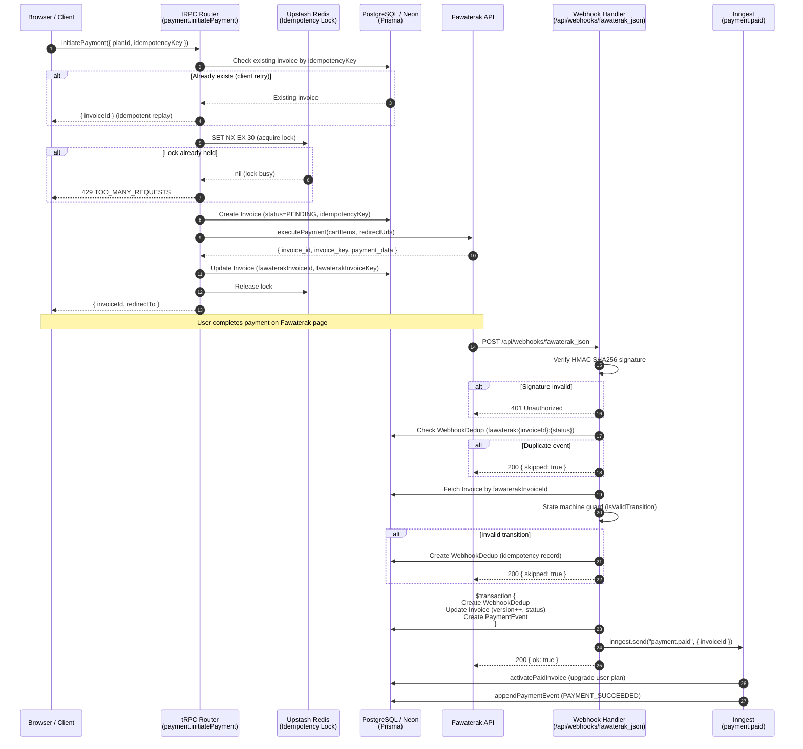
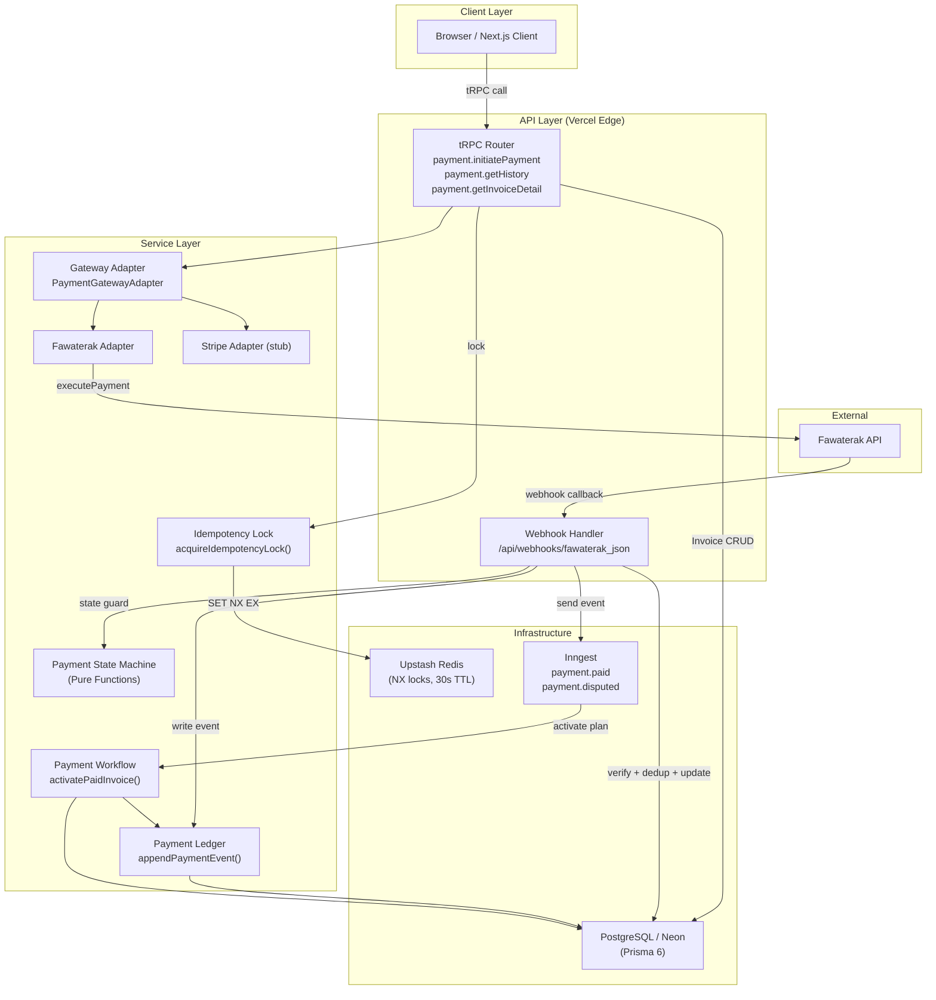

# Payment Architecture — Documentation

## Sequence Diagram — Successful Payment Flow



---

## Architecture Diagram — System Components



---

## Security Review

### 1. HMAC Signature Validation (OWASP A02: Cryptographic Failures)

**Threat**: Attacker forges a webhook payload to trigger unauthorized subscription activation.

**Mitigation**:
- `fawaterakAdapter.verifyWebhookSignature()` always runs before any DB reads.
- Uses `crypto.timingSafeEqual` to prevent timing attacks on signature comparison.
- Returns `401` immediately on failure — no partial processing occurs.
- There is **no bypass** — the previous `if (receivedHash && ...)` guard was removed.

### 2. Idempotency Key Collision (OWASP A04: Insecure Design)

**Threat**: A malicious client reuses another user's idempotency key to replay their payment.

**Mitigation**:
- On lookup, `getInvoiceDetail` and `initiatePayment` both check `userId === ctx.user.id`.
- The `idempotencyKey` is stored with `userId` in the Redis lock: `idempotency:{userId}:{key}`.
- A colliding key from a different user will create a new invoice (different userId context).

### 3. Webhook Replay Attacks (OWASP A04: Insecure Design)

**Threat**: Gateway retries the same webhook, triggering double-activation.

**Mitigation**:
- `WebhookDedup` table records `(gatewayEventId, eventType)` before any state mutation.
- Dedup key format: `fawaterak:{invoiceId}:{status}` — unique per event.
- Both check and write happen in the same `$transaction`, preventing TOCTOU races.

### 4. Optimistic Concurrency (OWASP A04: Insecure Design)

**Threat**: Two concurrent webhooks both read `version=1`, both try to write `version=2`.

**Mitigation**:
- Invoice updates use `where: { id, version: current }` + `version: { increment: 1 }`.
- If the version was already bumped, Prisma throws `P2025` (record not found) — caught and returned as 200.
- This ensures only one concurrent write wins; the other is safely discarded.

### 5. Redis Connection Exhaustion (OWASP A05: Security Misconfiguration)

**Threat**: A burst of `/initiatePayment` calls exhausts the Redis connection pool.

**Mitigation**:
- Uses Upstash Redis HTTP REST API (stateless, no persistent connections).
- Lock TTL is 30 seconds — leaked locks auto-expire.
- `finally` block in `initiatePayment` always releases the lock.

### 6. Append-Only Event Ledger (OWASP A09: Security Logging Failures)

**Threat**: Modification or deletion of payment records hides fraudulent activity.

**Mitigation**:
- `payment_event` table has BEFORE UPDATE and BEFORE DELETE triggers that `RAISE EXCEPTION`.
- All event writes go through `appendPaymentEvent()` — the single choke point.
- `rawPayload` stores the original gateway payload for audit purposes.

### 7. Input Validation (OWASP A03: Injection)

**Threat**: Malformed webhook payloads crash the handler or cause unexpected DB writes.

**Mitigation**:
- All status values are gated through `normalizeWebhookStatus()` which returns a known enum or `undefined`.
- Unknown statuses return `200 { skipped: true }` without touching the DB.
- tRPC input schemas use Zod v4 with strict types.

---

## Deployment Guide

### Environment Variables

| Variable | Description | Required |
|---|---|---|
| `FAWATERAK_API_KEY` | Fawaterak API key | Yes |
| `FAWATERAK_WEBHOOK_SECRET` | HMAC secret for webhook signature | Yes |
| `UPSTASH_REDIS_REST_URL` | Upstash Redis REST endpoint | Yes |
| `UPSTASH_REDIS_REST_TOKEN` | Upstash Redis REST token | Yes |
| `DATABASE_URL` | Neon PostgreSQL connection string | Yes |
| `NEXT_PUBLIC_APP_URL` | Public URL for redirect/webhook URLs | Yes |

### Database Migration

```bash
# Run the payment events migration
pnpm prisma migrate deploy
```

The migration adds:
- `idempotencyKey` (unique) and `version` columns to `invoice`
- `payment_event` table with immutability triggers
- `webhook_dedup` table
- Extended `InvoiceStatus` enum values

### Neon / pgBouncer Configuration

- Use **Transaction mode** pgBouncer with Prisma (set `connection_limit=1` on the pool URL).
- Neon auto-pause: ensure `CONNECT_TIMEOUT` is set to ≥10s to handle cold starts.
- For the webhook handler, use a **direct connection** (non-pooled) URL for `$transaction` calls to avoid advisory lock issues.

```env
# Pooled (for most queries)
DATABASE_URL="postgresql://...@pooler.neon.tech:5432/db?pgbouncer=true"
# Direct (for migrations + transactions)
DATABASE_URL_UNPOOLED="postgresql://...@direct.neon.tech:5432/db"
```

Update `prisma.config.ts` to use `DATABASE_URL_UNPOOLED` for `migrate` commands.

### Inngest Configuration

- Register `handlePaymentDisputed` in your Inngest serve route — it is already exported from `src/server/inngest/index.ts`.
- Set concurrency limits in the Inngest dashboard for `handle-payment-disputed` to prevent thundering herd on mass disputes.
- Recommended: set `retries: 3` (already configured) with exponential backoff.

### Webhook Burst Handling

- Fawaterak may replay webhooks up to 3× on non-2xx responses.
- The `WebhookDedup` table ensures replays are no-ops (returns 200 immediately).
- For high-traffic scenarios, add a Vercel Edge Function rate limit or Cloudflare WAF rule on `/api/webhooks/fawaterak_json` to block abuse (max 100 req/min from Fawaterak IP ranges).

### Rollback Plan

If the migration needs to be rolled back:
1. Drop the `payment_event` and `webhook_dedup` tables.
2. Remove `idempotencyKey` and `version` columns from `invoice`.
3. Revert `InvoiceStatus` enum changes (requires PostgreSQL enum rollback — see migration comments).

> ⚠️ Enum rollbacks in PostgreSQL require renaming the old enum back. Plan for this before deploying to production if zero-downtime rollback is required.
