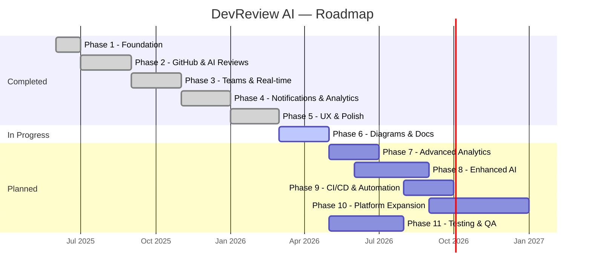

# DevReview AI — Project Plan

> Phased roadmap covering completed features, upcoming work, and architectural diagrams.

---

## Phase 1 ✅ — Foundation & Core Infrastructure

> **Status:** Complete

### Features Delivered

| #   | Feature               | Description                                                                  |
| --- | --------------------- | ---------------------------------------------------------------------------- |
| 1.1 | Project Scaffolding   | Next.js 16 App Router, TypeScript strict mode, pnpm workspace, Tailwind 4    |
| 1.2 | Database Setup        | PostgreSQL + Prisma ORM with schema, migrations, and generated client        |
| 1.3 | Authentication        | Better Auth with GitHub OAuth, session management, middleware error handling |
| 1.4 | tRPC API Layer        | tRPC v11 server/client setup with superjson, React Query bindings            |
| 1.5 | UI Component Library  | shadcn/ui primitives (button, dialog, card, avatar, badge, checkbox, etc.)   |
| 1.6 | Theme Support         | Dark/light mode via `next-themes`, CSS variables in `globals.css`            |
| 1.7 | Rate Limiting         | Upstash Redis rate limiter on public-facing API routes                       |
| 1.8 | Path Aliases & ESLint | `@/*` imports, ESLint flat config with Next.js core-web-vitals + TS rules    |

---

## Phase 2 ✅ — GitHub Integration & AI-Powered Reviews

> **Status:** Complete

### Features Delivered

| #   | Feature                    | Description                                                                  |
| --- | -------------------------- | ---------------------------------------------------------------------------- |
| 2.1 | GitHub OAuth Connection    | Users connect GitHub accounts to import repositories                         |
| 2.2 | Repository Management      | List, connect, and manage GitHub repos (`repository` tRPC router)            |
| 2.3 | Pull Request Fetching      | Fetch open PRs and diffs from GitHub API (`pull-request` router)             |
| 2.4 | Multi-Provider AI Reviews  | AI-powered code analysis via Google Gemini, Groq, Hugging Face, OpenAI       |
| 2.5 | Review Processing Pipeline | Background PR review via Inngest (`review-pr` function) with status tracking |
| 2.6 | Review Results UI          | Review summary, risk score, quality metrics, inline comments display         |
| 2.7 | Diff Viewer                | Side-by-side diff viewer component for PR file changes                       |
| 2.8 | Code Timeline              | Visual code timeline component for tracking changes                          |
| 2.9 | Review Status Lifecycle    | `PENDING → PROCESSING → COMPLETED / FAILED` state machine                    |

---

## Phase 3 ✅ — Team Collaboration & Real-time Features

> **Status:** Complete

### Features Delivered

| #   | Feature                      | Description                                                              |
| --- | ---------------------------- | ------------------------------------------------------------------------ |
| 3.1 | Team CRUD                    | Create teams with slug, image, and member management                     |
| 3.2 | Role-Based Access Control    | `OWNER > ADMIN > MEMBER` hierarchy with role enforcement                 |
| 3.3 | Team Actions / Approval Flow | Action queue for invite, remove, role change, share repo (with approval) |
| 3.4 | Repository Sharing           | Share/unshare repos with teams                                           |
| 3.5 | Real-time via Pusher         | Live collaborative review features and instant updates                   |
| 3.6 | Review Threads & Comments    | Threaded discussions on specific file lines within reviews               |
| 3.7 | Collaborative Review UI      | Real-time collaborative review component                                 |

---

## Phase 4 ✅ — Notifications, Email & Analytics

> **Status:** Complete

### Features Delivered

| #   | Feature                  | Description                                                          |
| --- | ------------------------ | -------------------------------------------------------------------- |
| 4.1 | In-App Notifications     | Real-time notification system (team invite, review completed/failed) |
| 4.2 | Email Notifications      | Resend + React Email templates for review completed & member added   |
| 4.3 | Analytics Dashboard      | Metrics grid, charts, quality/workload stats, anomaly alerts         |
| 4.4 | Animated Number Counters | Smooth animated metric transitions                                   |
| 4.5 | Quick Actions Card       | Analytics shortcut actions for common workflows                      |

---

## Phase 5 ✅ — User Experience & Polish

> **Status:** Complete

### Features Delivered

| #   | Feature           | Description                                                       |
| --- | ----------------- | ----------------------------------------------------------------- |
| 5.1 | Landing Page      | Hero, features, how-it-works, stats, languages, CTA, footer       |
| 5.2 | GSAP Animations   | Page transitions, background animations, scroll-triggered effects |
| 5.3 | User Profile Page | View/edit profile, avatar upload with image cropping              |
| 5.4 | Settings Page     | Review preferences (depth, language, auto-review, security, perf) |
| 5.5 | Error Handling    | Error boundary component, auth-error page, 404 not-found page     |
| 5.6 | File Uploads      | Avatar upload via Vercel Blob with crop dialog                    |
| 5.7 | Health Check      | System health monitoring component                                |

---

## Phase 7 🆕 — Advanced Analytics & Reporting (Planned)

> **Status:** Planned | **Priority:** High

| #   | Feature                   | Description                                                  |
| --- | ------------------------- | ------------------------------------------------------------ |
| 7.1 | Historical Trend Analysis | Track code quality over weeks/months with trend lines        |
| 7.2 | Per-Developer Metrics     | Individual contributor review stats and improvement tracking |
| 7.3 | Repository Health Score   | Composite health score per repo based on review history      |
| 7.4 | Exportable PDF Reports    | Generate downloadable PDF reports of analytics and reviews   |
| 7.5 | Custom Date Range Filters | Flexible date range selection for all analytics views        |
| 7.6 | Comparative Analytics     | Compare quality metrics across repos and teams               |

---

## Phase 8 🆕 — Enhanced AI Capabilities (Planned)

> **Status:** Planned | **Priority:** High

| #   | Feature                      | Description                                                       |
| --- | ---------------------------- | ----------------------------------------------------------------- |
| 8.1 | AI Provider Selection UI     | Let users choose preferred AI provider per review                 |
| 8.2 | Custom Review Rules          | User-defined review rules and coding standards for AI to enforce  |
| 8.3 | Auto-Fix Suggestions         | AI generates patch suggestions that can be applied with one click |
| 8.4 | Multi-File Context Awareness | AI considers cross-file dependencies for deeper analysis          |
| 8.5 | Review Feedback Loop         | Users rate AI suggestions to improve future reviews               |
| 8.6 | Security Vulnerability DB    | Cross-reference findings with CVE databases                       |

---

## Phase 9 🆕 — CI/CD & Automation (Planned)

> **Status:** Planned | **Priority:** Medium

| #   | Feature                       | Description                                                  |
| --- | ----------------------------- | ------------------------------------------------------------ |
| 9.1 | GitHub Webhook Auto-Review    | Automatically trigger reviews on new PRs via webhook events  |
| 9.2 | PR Status Checks              | Post review results as GitHub status checks on PRs           |
| 9.3 | GitHub Comments Integration   | Post AI review comments directly on GitHub PR diffs          |
| 9.4 | Branch Protection Rules Guide | Recommend branch protection settings based on review results |
| 9.5 | Scheduled Repository Scans    | Cron-based full repo scans via Inngest scheduled functions   |

---

## Phase 10 🆕 — Platform Expansion (Planned)

> **Status:** Planned | **Priority:** Medium

| #    | Feature                       | Description                                             |
| ---- | ----------------------------- | ------------------------------------------------------- |
| 10.1 | GitLab Integration            | Extend beyond GitHub to support GitLab repos and MRs    |
| 10.2 | Bitbucket Integration         | Support Bitbucket Cloud repositories and PRs            |
| 10.3 | Organization-Level Management | Org-wide settings, billing, and user management         |
| 10.4 | API Key / Public API          | REST API for third-party integrations and CLI tools     |
| 10.5 | VS Code Extension             | Review code directly from the editor                    |
| 10.6 | Mobile Responsive Dashboard   | Fully optimized mobile experience for on-the-go reviews |

---

## Phase 11 🆕 — Testing & Quality Assurance (Planned)

> **Status:** Planned | **Priority:** High

| #    | Feature                 | Description                                                      |
| ---- | ----------------------- | ---------------------------------------------------------------- |
| 11.1 | Unit Test Suite         | Jest tests for all tRPC routers, services, and utility functions |
| 11.2 | Integration Tests       | End-to-end tests for critical flows (auth, review, team)         |
| 11.3 | AI Mock Test Harness    | Standardized mock responses for all AI providers in tests        |
| 11.4 | CI Pipeline             | GitHub Actions for lint, typecheck, test, and build on every PR  |
| 11.5 | Code Coverage Reporting | Track and enforce minimum coverage thresholds                    |

---

## Summary Timeline

---

_Last updated: April 2026_
